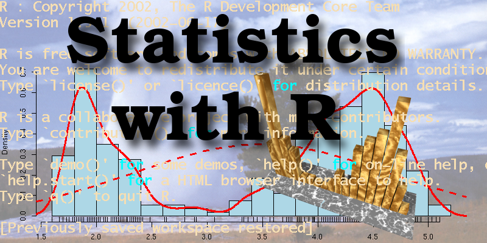
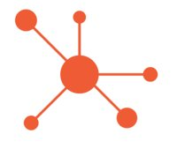
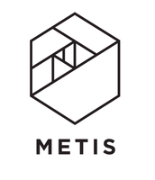

Title: Programs
{: style='float: left; width: 250px; height: 200px; margin-right: 30px; margin-bottom: 15px; border: 1px solid #eee'}

### [Deep Learning with TensorFlow](https://www.thisismetis.com/deep-learning-with-tensorflow){:target='_blank'}
Dates: Feb 20th to March 29
Instructor: Sam Abrahams
Location: San Francisco

Description:
This course teaches the core concepts of deep learning using TensorFlow, Google’s open-source computation graph library.

Deep learning has become standard in the tech industry, achieving state-of-the-art results in computer vision, natural language processing, and artificial intelligence. TensorFlow provides the flexibility needed to implement and research cutting edge architectures while allowing users to focus on the structure of their models as opposed to mathematical minutiae. Students will learn modern techniques with hands-on model building, data collection/transformation, and deployment.

{: style='float: left; width: 250px; height: 200px; margin-right: 30px; margin-bottom: 15px; border: 1px solid #eee'}

### [Statistical Foundations For Data Science and Machine Learning](https://www.thisismetis.com/statistical-foundations){:target='_blank'}
Dates: Feb 21 to Apr 13
Instructor: Greg Ryslik
Location: San Francisco

This course will serve as introduction to basic statistical principles that are often used by data scientists and applied statisticians. Many of the concepts will be reinforced by using the statistical programming language R, one of the two most popular languages for Data Science.

The intent of this course is to expose students to common statistical issues and teach them how to avoid statistical fallacies. We begin with a high-level overview of probability and common statistical estimates and then proceed to move advanced topics like multiple hypothesis testing, independence, sample size and power calculations as well as bootstrapping.

By the end of the course, students will have a fundamental understanding of many of the statistical principles that underlie machine learning and data science.

{: style='float: left; width: 250px; height: 200px; margin-right: 30px; margin-bottom: 15px; border: 1px solid #eee'}

### [StartupML's Machine Learning Fellowship](https://startup.ml/){:target='_blank'}
Dates: Aug 2016 to Dec 2016
Location: Oakland

4-month fellowship building real-world machine learning applications for industry clients involving quantitative finance, security, and startup related products. Worked on two projects that involved software engineering, unsupervised learning, and time-series based financial ensemble techniques.

{: style='float: left; width: 250px; height: 200px; margin-right: 30px; margin-bottom: 15px; border: 1px solid #eee'}

### [Metis](https://www.thisismetis.com/){:target='_blank'}
Dates: Jan 2016 - May 2016
Location: San Francisco
Instructor: Paul Burkard, Laur Skelly

Using Python as a foundation, Metis is an immersive program that focuses on enhancing skills used in the data science industry. Metis teaches and reinforces concepts such as statistical inference, data acquisition, supervised and unsupervised machine learning.

{: style='float: left; width: 250px; height: 200px; margin-right: 30px; margin-bottom: 15px; border: 1px solid #eee'}

### [General Assembly](https://generalassemb.ly/){:target='_blank'}
Dates: July 2015 - September 2015
Location: San Francisco
Instructor: Sinan Ozdemir

Learn the tools and techniques you need to make better decisions through data, and land a job in one of the most sought after fields in tech. Create predictive models by learning to wrangle, analyze, and visualize data from our team of professional Data Scientist instructors. Develop hard skills like Unix, Git, SQL, Python, machine learning, and modeling techniques while creating your own data projects and applications.

